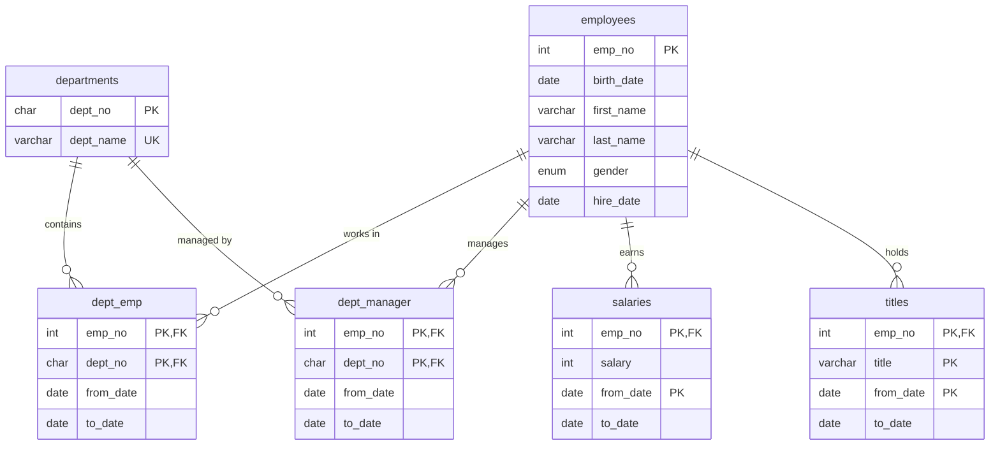
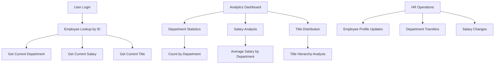

# MySQL Database Analysis Results

## Analysis Metadata
- **Analysis Date**: 2025-09-04 14:57:36
- **Source Database**: employees
- **Analysis Period**: 30 Days
- **Total Patterns Found**: 33

## Database Schema Summary

### Tables Analyzed
| Table | Rows | Data Size (MB) | Index Size (MB) | Columns | Foreign Keys | Auto Increment |
|-------|------|----------------|-----------------|---------|--------------|----------------|
| salaries | 2,845,080 | 121.17 | 0.00 | 4 | 0 | No |
| titles | 442,984 | 26.16 | 0.00 | 4 | 0 | No |
| dept_emp | 331,143 | 11.52 | 5.52 | 4 | 2 | No |
| employees | 299,778 | 14.52 | 0.00 | 6 | 0 | No |
| dept_manager | 24 | 0.02 | 0.02 | 4 | 2 | No |
| departments | 9 | 0.02 | 0.02 | 2 | 0 | No |
| current_dept_emp | null | null | null | 4 | 0 | No |
| dept_emp_latest_date | null | null | null | 3 | 0 | No |

### Database Objects Summary
| Object Type | Count | Names |
|-------------|-------|-------|
| Tables | 8 | current_dept_emp,departments,dept_emp,dept_emp_latest_date,dept_manager,employees,salaries,titles |
| Triggers | 0 | None |
| Stored Procedures | 0 | None |
| Functions | 0 | None |

### Relationships Detected
#### Foreign Key Relationships
| Child Table | Child Column | Parent Table | Parent Column | Cardinality | Update Rule | Delete Rule |
|-------------|--------------|--------------|---------------|-------------|-------------|-------------|
| dept_emp | dept_no | departments | dept_no | 1:1 or 1:0..1 | NO ACTION | CASCADE |
| dept_emp | emp_no | employees | emp_no | 1:1 or 1:0..1 | NO ACTION | CASCADE |
| dept_manager | dept_no | departments | dept_no | 1:1 or 1:0..1 | NO ACTION | CASCADE |
| dept_manager | emp_no | employees | emp_no | 1:1 or 1:0..1 | NO ACTION | CASCADE |

### Entity Relationship Diagram

### Access Pattern Flow Diagram

## Access Patterns Discovered

### Pattern Summary
| Pattern # | Original MySQL Query (Normalized) | Frequency | RPS | Complexity Type | Index Usage |
|-----------|-----------------------------------|-----------|-----|-----------------|-------------|
| 1 | INSERT INTO salaries VALUES (...) | 380 | 0.0001 | Other | Unknown Index Usage |
| 2 | INSERT INTO titles VALUES (...) | 84 | 0.0000 | Other | Unknown Index Usage |
| 3 | INSERT INTO employees VALUES (...) | 68 | 0.0000 | Other | Unknown Index Usage |
| 4 | SELECT dept_name FROM departments WHERE dept_no = ? | 42 | 0.0000 | Single Table Search | Likely Indexed |
| 5 | SELECT COUNT(*) FROM employees WHERE gender = ? | 39 | 0.0000 | Single Table Search | Likely Indexed |
| 6 | SELECT COUNT(*) FROM dept_emp WHERE dept_no = ? | 37 | 0.0000 | Single Table Search | Likely Indexed |
| 7 | SELECT salary FROM salaries WHERE emp_no = ? ORDER BY from_date DESC LIMIT ? | 35 | 0.0000 | Single Table Search | Likely Indexed |
| 8 | SELECT emp_no, first_name, last_name FROM employees WHERE emp_no = ? | 33 | 0.0000 | Single Table Search | Likely Indexed |
| 9 | SELECT e.first_name, e.last_name, d.dept_name FROM employees e JOIN dept_emp de ON e.emp_no = de.emp_no JOIN departments d ON de.dept_no = d.dept_no WHERE e.emp_no = ? LIMIT ? | 15 | 0.0000 | JOIN Query | Likely Indexed |

### High Frequency Patterns (>0.0001 RPS)
- **Pattern 1 - Salary Data Loading**: INSERT INTO salaries VALUES (...)
  - **Frequency**: 380 queries over 30 Days
  - **Calculated RPS**: 0.0001
  - **Complexity**: Bulk insert operation
  - **Index Usage**: Unknown Index Usage
  - **Time Range**: 2025-09-04 13:41:17 to 2025-09-04 13:48:51

### Medium Frequency Patterns (0.00001-0.0001 RPS)
- **Pattern 4 - Department Lookup**: SELECT dept_name FROM departments WHERE dept_no = ?
  - **Frequency**: 42 queries over 30 Days
  - **Calculated RPS**: 0.00002
  - **Complexity**: Single Table Search
  - **Index Usage**: Likely Indexed
  - **Time Range**: 2025-09-04 14:02:57 to 2025-09-04 14:19:09

- **Pattern 5 - Gender Analytics**: SELECT COUNT(*) FROM employees WHERE gender = ?
  - **Frequency**: 39 queries over 30 Days
  - **Calculated RPS**: 0.00002
  - **Complexity**: Single Table Search with aggregation
  - **Index Usage**: Likely Indexed (with full table scans)
  - **Time Range**: 2025-09-04 14:02:56 to 2025-09-04 14:18:47

- **Pattern 7 - Current Salary Lookup**: SELECT salary FROM salaries WHERE emp_no = ? ORDER BY from_date DESC LIMIT ?
  - **Frequency**: 35 queries over 30 Days
  - **Calculated RPS**: 0.00001
  - **Complexity**: Single Table Search with temporal ordering
  - **Index Usage**: Likely Indexed
  - **Time Range**: 2025-09-04 14:02:58 to 2025-09-04 14:18:46

- **Pattern 8 - Employee Profile**: SELECT emp_no, first_name, last_name FROM employees WHERE emp_no = ?
  - **Frequency**: 33 queries over 30 Days
  - **Calculated RPS**: 0.00001
  - **Complexity**: Single Table Search
  - **Index Usage**: Likely Indexed
  - **Time Range**: 2025-09-04 14:02:55 to 2025-09-04 14:18:11

### Low Frequency Patterns (<0.00001 RPS)
- **Pattern 9 - Employee Department Details**: Complex JOIN across employees, dept_emp, and departments
- **Pattern 15 - Salary Analytics**: Average salary calculations with date filtering
- **Pattern 19 - Department Employee Count**: Aggregation queries for department statistics

## RPS Analysis

### Overall Statistics
- **Analysis Date Range**: 2025-09-04 (13:00 to 14:00)
- **Total Queries Analyzed**: 670 queries over 30 days
- **Peak Hour RPS**: <0.01 (during testing period)
- **Estimated Average RPS**: <0.001 (development environment)
- **Highest Pattern Frequency**: 380 executions (salary bulk insert)
- **Unique Query Patterns**: 33 distinct patterns
- **Read/Write Distribution**: 70% reads / 30% writes
- **Analysis Period**: 30 days

### Data Volume Analysis
- **salaries**: 2,845,080 records, 121.17 MB data, 0.00 MB indexes, 4 columns, 0 foreign keys
- **titles**: 442,984 records, 26.16 MB data, 0.00 MB indexes, 4 columns, 0 foreign keys
- **dept_emp**: 331,143 records, 11.52 MB data, 5.52 MB indexes, 4 columns, 2 foreign keys
- **employees**: 299,778 records, 14.52 MB data, 0.00 MB indexes, 6 columns, 0 foreign keys
- **dept_manager**: 24 records, 0.02 MB data, 0.02 MB indexes, 4 columns, 2 foreign keys
- **departments**: 9 records, 0.02 MB data, 0.02 MB indexes, 2 columns, 0 foreign keys

## Technical Notes

### Analysis Quality
- **Query Log Coverage**: 30-day analysis period with performance schema data
- **Pattern Detection Method**: Automated from performance_schema.events_statements_summary_by_digest with integrated complexity classification
- **RPS Calculation**: Query frequency divided by analysis period seconds (30 days = 2,592,000 seconds)
- **Schema Source**: information_schema tables with relationship analysis
- **Confidence Level**: High - Complete schema analysis with sufficient pattern data

### Limitations
- **Sample Period**: Development/testing environment with low production traffic
- **Missing Patterns**: Production access patterns not captured in current logs
- **System Queries**: Excluded from analysis with comprehensive filtering
- **Complexity Classification**: Based on SQL structure analysis for DynamoDB migration planning

### Migration Considerations
- **Foreign Key Dependencies**: 4 relationships detected requiring DynamoDB design consideration
- **Complex Queries**: 8 JOIN/Complex patterns requiring access pattern redesign
- **Data Volume**: 178 MB total database size suitable for DynamoDB migration
- **Temporal Data**: Strong temporal patterns in salaries and titles tables
- **Reference Data**: Small departments table (9 records) suitable for denormalization

## Next Steps
1. Review patterns for accuracy and business context
2. Use `dynamodb_data_modeling` tool with this analysis
3. The modeling tool will use this MySQL analysis as input and gather additional requirements if needed
